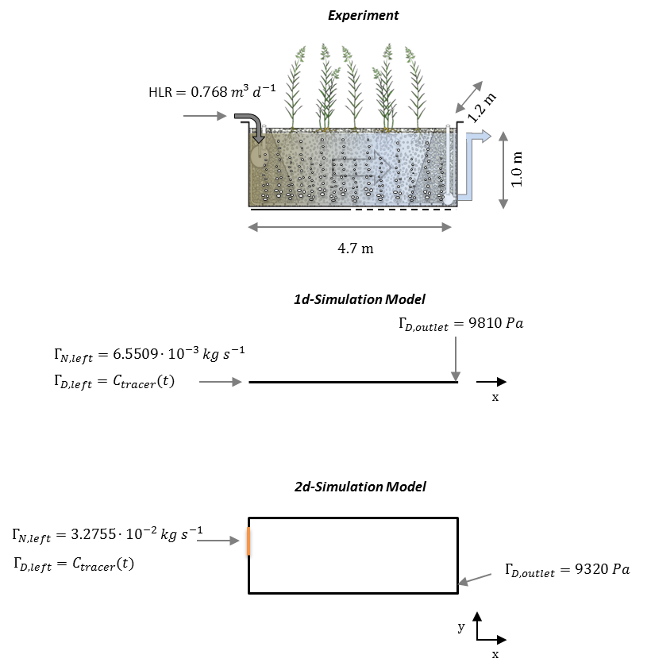
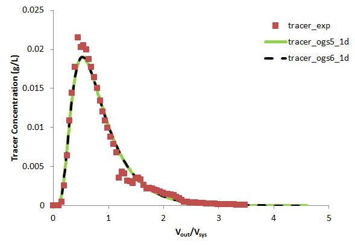
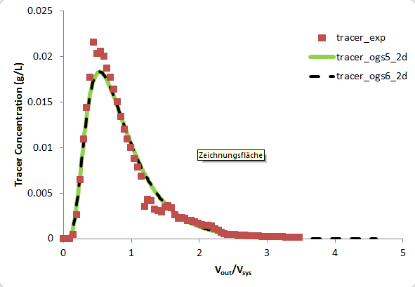

+++
author = "Johannes Boog, Reviewer: Vanessa Montoya"
weight = 143
project = "Parabolic/ComponentTransport/ConTracer/ConTracer_1d.prj"
date = "2019-07-18T10:30:09+01:00"
title = "Conservative tracer transport with time varying source (1D/2D)"

[menu]
  [menu.benchmarks]
    parent = "Hydro-Component"

+++



## Overview

This benchmark describes the transport of a conservative tracer through a saturated porous media. Simulations have been performed with OGS-6 and OGS-5 in both, 1D and 2D domains.
Additionally, simulations have been compared with experimental data obtained from a hydraulic tracer experiment conducted in a pilot--scale horizontal flow constructed wetland (Boog, 2013; Boog *et al.*, 2019)

The experimental system consists of a box of 4.7 m in length, 1.2 m in width and 1.05 m in depth (Nivala *et al.* 2013).
The box was filled with gravel giving an average porosity of 0.38. The initial water level was at 1.0 meter and the outflow was realized by an overflow pipe of 1.0 m height.
Hydraulic water influx was 0.768 $\textrm{m}^3~\textrm{d}^{-1}$ at the left side.
The tracer (40.26 g of $\textrm{Br}^-$) was diluted in 12 L of waste water and added as a single impulse event at $t=0$.
Note, that only 89\% of the tracer was recovered at the outlet.

## Problem description (1D)

For the 1D simulation the model domain was discretized into 94 line elements (element size of 0.05 m).
A regular time stepping scheme with a step size of 3600 s was used.
The tracer impulse was treated as a time dependent Dirichlet BC ($\Gamma_{D, left} (t)= c_{tracer}(t)$), which results in an added tracer (mass) combined with the water volume influx.
Material properties as well as initial and boundary conditions are listed in the following tables.
Due to the high evaporation during the experiment, the average measured influent and effluent water volume fluxes was used as boundary condition for the simulations ($g_{N,left}^p$).
The boundary condition of the tracer ($g_{D,left}^{c_{tracer}}$) at the inlet was multiplied with the mass recovery rate of 89% of the tracer.

---------------------- ---------- ----------- ------------

|Parameter | Description | Value | Unit  |
|:-------  | :-------- |-----:|:------:|
|$\phi$     | Porosity   | 0.38  |  |
|$\kappa$   | Permeability | 1.00E-08 | $\textrm{m}^2$ |
|$S$       | Storage     | 0     |  |
|$a_L$     | long. Dispersion length | 0.7   | m |
|$a_T$     | transv. Dispersion length | 0.07  | m |
|$\rho_w$   | Fluid density | 1.00E+03 | $\textrm{kg m}^{-3}$ |
|$\mu_w$    | Fluid viscosity | 1.00E-03 | Pa s |
|$D_{tracer}$ | Tracer diffusion coef. | 0  | $\textrm{m}^2~\textrm{s}^{-1}$ |
|$g$       | Gravity acceleration in $y$ direction | 9.81 | $\textrm{m s}^{-2}$ |

---------------------- ---------- ----------- ------------

Table 1: Material Properties

---------------------- ---------- ----------- ------------

| Parameter | Description | Value | Unit  |
|:--------- |:----------  | -----:|------:|
|$g_{N,left}^p$ | Influent mass influx | 6.55093e-03 | $\textrm{kg s}^{-1}$ |
|$g_{D,outlet}^p$ | Pressure at outlet | 9810 | Pa |
|$g_{D,left}^{c_{tracer}}$ | Tracer concentration | $1.19438~\textrm{for}~t\leq 3600,~0~\textrm{for}~t>3600$ | $\textrm{g L}^{-1}$|
|$p(t=0)$   | Initial pressure | 9810  | Pa |
|$c_{tracer}(t=0)$ | Initial tracer concentration | 0  | $\textrm{g L}^{-1}$ |

---------------------- ---------- ----------- ------------

Table 2: Initial and boundary conditions for the 1D scenario

## Problem description (2D)

For the 2D simulation, the domain was discretized into a rectangular mesh with 1880 quadratic elements (element size of 0.05 m).
A regular time stepping scheme with a step size of 3600 s was used.
Material properties, initial and boundary conditions are presented in the table below.

---------------------- ---------- ----------- ------------

| Parameter | Description | Value | Unit  |
|:--------- | :---------- | -----:| -----:|
| $g_{N,left}^p$ | Influent mass influx | 3.27546e-02 | $\textrm{kg s}^{-1}$ |
| $g_{D,outlet}^p$ | Pressure at outlet | 9320 | Pa |
| $g_{D,left}^{c_{tracer}}$ | Tracer concentration | $1.19438~\textrm{for}~t\leq 3600,~0~\textrm{for}~t>3600$ | $\textrm{g L}^{-1}$ |
| $p(t=0)$  | Initial pressure | $9810-9810y$ | Pa |
| $c_{tracer}(t=0)$ | Initial tracer concentration | 0  | $\textrm{g L}^{-1}$ |

---------------------- ---------- ----------- ------------

Table 3: Initial and boundary conditions for the 2D scenario

## Results

Both models (1D and 2D) fit the experimental tracer breakthrough curves quite well.
The deviance at the peak and tail can be related to the fact that the simulations only consider conservative equilibrium transport (processes that may have occurred in the experimental system such as tracer sorption, non--equilibrium flow and evapotranspiration were not considered in the model).
The differences between the OGS-6 and OGS-5 simulation were very low (RMSQE$=$1.37e-07).

## References

Boog, 2013. Effect of the Aeration Scheme on the Treatment Performance of Intensified Treatment Wetland Systems (Diploma Thesis). TU Bergakademie Freiberg; Institut für Thermische-, Umwelt- und Naturstoffverfahrenstechnik, Freiberg, Germany

Boog, J., Kalbacher, T., Nivala, J., Forquet, N., van Afferden, M., Müller, R.A., 2019. Modeling the relationship of aeration, oxygen transfer and treatment performance in aerated horizontal flow treatment wetlands. Water Res. 157 , 321 - 334

Nivala, J., Headley, T., Wallace, S., Bernhard, K., Brix, H., van Afferden, M., Müller, R.A, 2013. Comparive analysis of constructed wetlands: the design and construction of the ecotechnology research facility in Langenreichenbach, Germany. Ecol. Eng., 61, 527-543
