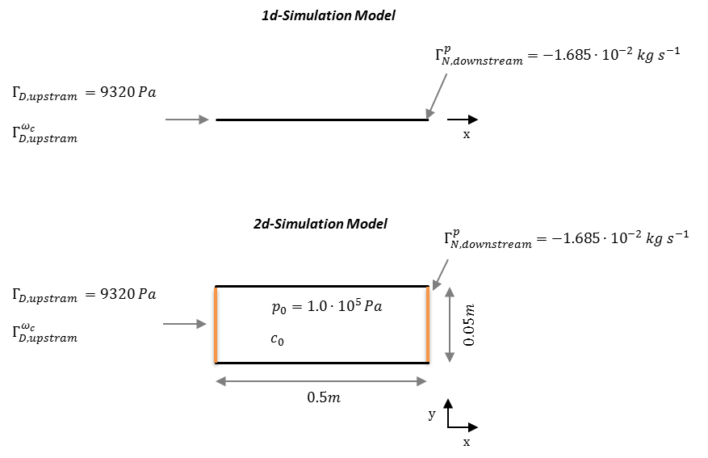

+++
author = "Johannes Boog"
weight = 143
project = "Parabolic/ComponentTransport/ReactiveTransport/KineticReactant_AllAsComponents/KineticReactant2.prj"
date = "2010-06-25T14:41:09+01:00"
title = "Solute transport including kinetic reaction"

[menu]
  [menu.benchmarks]
    parent = "Reactive Transport"

+++



## Overview

<!-- vale off -->

This scenario describes the transport of two solutes (Synthetica and Syntheticb) through a saturated media.
Both solutes react to Productd according to $\text{Product d}=\text{Synthetic a}+0.5~\text{Synthetic b}$.
The speed of the reaction is described with a first--order relationship $\frac{dc}{dt}=U(\frac{c_{\text{Synthetic a}}}{K_m+c_{\text{Synthetic b}}})$.
The coupling of OGS-6 and IPhreeqc used for simulation requires to simulate the transport of $H^+$--ions, additionally.
This is required to adjust the compulsory charge balance computation executed by Phreeqc.
The solution by OGS-6--IPhreeqc will be compared to the solution by a coupling of OGS-5--IPhreeqc.

## Problem Description

**1d scenario:**
The 1d--model domain is 0.5 m long and discretised into 200 line elements.
The domain is saturated at start--up ($p(t=0)=$ 1.0e-5 Pa).
A constant pressure is defined at the left side boundary ($g_{D,\text{upstream}}^p$) and a Neumann BC for the water mass out-flux at the right side ($g_{N,\text{downstream}}^p$).
Both solutes, Synthetic a and Synthetic b are present at simulation start--up at concentrations of $c_{\text{Synthetic a}}(t=0)=c_{\text{Synthetic b}}(t=0)= 0.5~\textrm{mol kg}^{-1}~\textrm{water}$, the influent concentration is $0.5~\textrm{mol kg}^{-1}~\textrm{water}$ as well.
Product d is not present at start--up ($c_{\text{Productd}}(t=0)=0$); neither in the influent.
The initial concentration of $\text{H}^+$--ions is $1.0e\textrm{-}7~\textrm{mol kg}^{-1}~\textrm{water}$; the concentration at the influent point is the same.
Respective material properties, initial and boundary conditions are listed in the tables below.

**2d scenario:**
The 2d--scenario only differs in the domain geometry and assignment of the boundary conditions.
The horizontal domain is 0.5 m in x and 0.5 m in y direction, and,  discretised into 10374 quadratic elemtents with an edge size of 0.0025 m.

-----------------------------------------

|Parameter | Description | Value | Unit |
|:-------- | :---------- | :---- | :--- |
| $\phi$   | Porosity    | 1.0   |  |
| $\kappa$ | Permeability | 1.157e-12 | $\textrm{m}^2$ |
| $S$   | Storage | 0.0     |  |
| $a_L$ | long. Dispersion length | 0.0   | m |
| $a_T$ | transv. Dispersion length | 0.0  | m |
| $\rho_w$ | Fluid density | 1.0e+3 | $\textrm{kg m}^{-3}$ |
| $\mu_w$ | Fluid viscosity | 1.0e-3 | Pa s |
| $D_{\text{H}^+}$ | Diffusion coef. for $\text{H}^+$ | 1.0e-7     | m$^2$ s |
| $D_{solutes}$ | Diffusion coef. for Synthetica, Syntheticb and Productd | 1.0e-12 | m$^2$ s |
| $U$ | Reaction speed constant | 1.0e-3 | h$^{-1}$ |
| $K_m$ | Half--saturation constant | 10 | mol kg$^{-1}$ water |

Table: Media, material and component properties

-----------------------------------------

| Parameter | Description | Value | Unit |
|:--------- | :---------- | :---- | :--- |
| $p(t=0)$  | Initial pressure | 1.0e+5  | Pa |
| $g_{N,downstream}^p$ | Water outflow mass flux | -1.685e-02 | mol kg$^{-1}$ water |
| $g_{D,upstream}^p$ | Pressure at inlet | 1.0e+5 | Pa |
| $c_{Synthetica}(t=0)$  | Initial concentration of Synthetica | 0.5     | mol kg$^{-1}$ water |
| $c_{Syntheticb}(t=0)$  | Initial concentration of Syntheticb | 0.5     | mol kg$^{-1}$ water |
| $c_{Productd}(t=0)$  | Initial concentration of Productd | 0     | mol kg${^-1}$ water |
| $c_{\text{H}^+}(t=0)$  | Initial concentration of $\text{H}^+$ | 1.0e-7     |  mol kg$^{-1}$ water |
|  $g_{D,upstream}^{Synthetica_c}$ | Concentration of Synthetica |  0.5 | mol kg$^{-1}$ water |
|  $g_{D,upstream}^{Syntheticb_c}$ | Concentration of Syntheticb |  0.5 | mol kg$^{-1}$ water |
|  $g_{D,upstream}^{Productd}$ | Concentration of Productd |  0.0 | mol kg$^{-1}$ water |
|  $g_{D,upstream}^{\text{H}^+}$ | Concentration of $\text{H}^+$ |  1.0e-7 | mol kg$^{-1}$ water |

Table: Initial and boundary conditions

## Results

The kinetic reaction results in the expected decline of the concentration of Synthetic a and Synthetic b, which is super-positioned by the influx of these two educts through the left side.
By contrast, the concentration of Product d increases in the domain.
Over time, opposed concentration fronts for educts and Product d evolve.
Both, OGS-6 and OGS-5 simulations yield the same results in the 1d as well as 2d scenario.
For instance, the difference between the OGS-6 and the OGS-5 computation for the concentration of Product d expressed as root mean squared error is 1.76e-7 mol kg$^{-1}$ water (over all time steps and mesh nodes, 1d scenario); the corresponding median absolute error is 1.0e-7 mol kg$^{-1}$ water.
This verifies the implementation of OGS-6--IPhreeqc.

