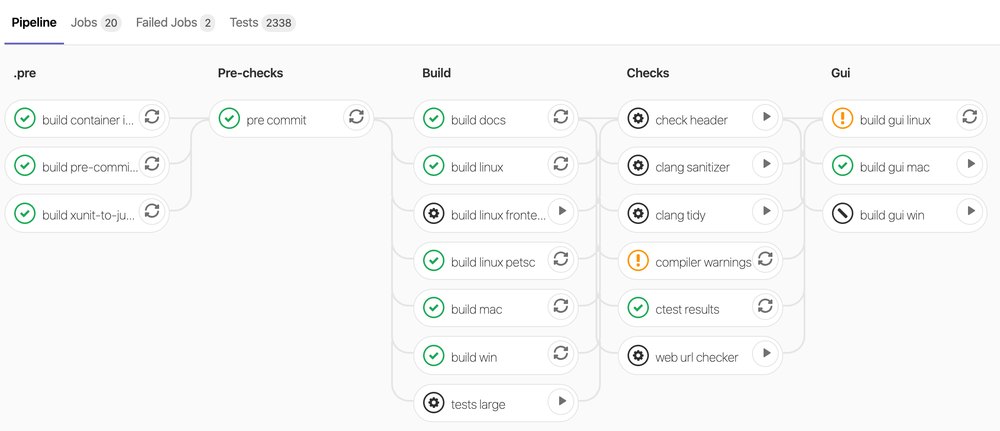

+++
date = "2018-02-26T11:00:13+01:00"
title = "GitLab CI"
author = "Lars Bilke"
weight = 1022

[menu]
  [menu.devguide]
    parent = "testing"
+++

## Introduction

[GitLab CI](https://docs.gitlab.com/ee/ci/) is a powerful [Continuous Integration](../../development-workflows/continuous-integration/) system integrated into GitLab.

The tasks of the CI system are configured in [scripts inside the OGS source code](https://gitlab.opengeosys.org/ogs/ogs/-/tree/master/scripts/ci). The entry point is defined in [`.gitlab-ci.yml`](https://gitlab.opengeosys.org/ogs/ogs/-/blob/master/.gitlab-ci.yml). Scripting and versioning the configuration together with the source code is very powerful, e.g. if you introduce a new OGS CMake configuration in a merge request even the change of the CI jobs configuration or jobs environment (Docker container definition) can be part of the merge request.

## GitLab Pipeline

A CI run consists of a [pipeline](https://docs.gitlab.com/ee/ci/pipelines/) which contains [stages](https://docs.gitlab.com/ee/ci/yaml/#stages) which in turn contain jobs. A job runs a set of instructions (e.g. checking out the source code, building the code, testing the code) on a [runner](https://docs.gitlab.com/runner/).

Each pipeline run is visualized as follows:


Jobs belong to a stage and each job will get a status (success, warnings, failure). Some jobs are optional (see the gear icon) and can be manually triggered by pressing the play button.

Some jobs run on native servers (e.g. on the `envinf[1,2,3]` Linux servers) and some run in [Docker containers]().

## Automatic testing

The master-branch of the main repository as well as all merge requests on that repository are automatically tested. See [the pipelines page](https://gitlab.opengeosys.org/ogs/ogs/pipelines).

### Skip automatic testing

If you want to skip a pipeline run for a push add the `-o ci.skip` git push option. Example:

```bash
git push -o ci.skip
```

Or add `[ci skip]` to the commit message to skip the pipeline for this commit. Example:

```bash
git commit -m "Added feature X [ci skip]"
```

## (Temporarily) reduce pipeline run time

During work on MR you may want to reduce the pipeline run time to get feedback faster. You can change the pipeline by editing the `.gitlab-ci.yml` and `scripts/ci/jobs/*.yml` files. It is good practice to mark these changes with commits starting with `drop: ...` in the commit message so they can be removed later easily.

### `.gitlab-ci.yml`

These variables modify the pipeline:

- `BUILD_TESTS`: Set this to `false` to disable unit tests.
- `BUILD_CTEST`: Set this to `false` to disable ctest (benchmark) tests.
- `CTEST_INCLUDE_REGEX`: Set this to a regex to select benchmarks to run, e.g. `nb` would select all notebook-based tests and would disable all other benchmarks.

All jobs get included in the `include:`-section. You can simple comment out files to disable jobs defined in that files. Please note that some jobs depend on other jobs.

### `scripts/ci/jobs/*.yml`

All jobs are defined in these files. You can disable a single job by prefixing its name with a dot, e.g.:

```yml
# enabled job:
build linux arch:

# disabled job:
.build linux arch:
```
