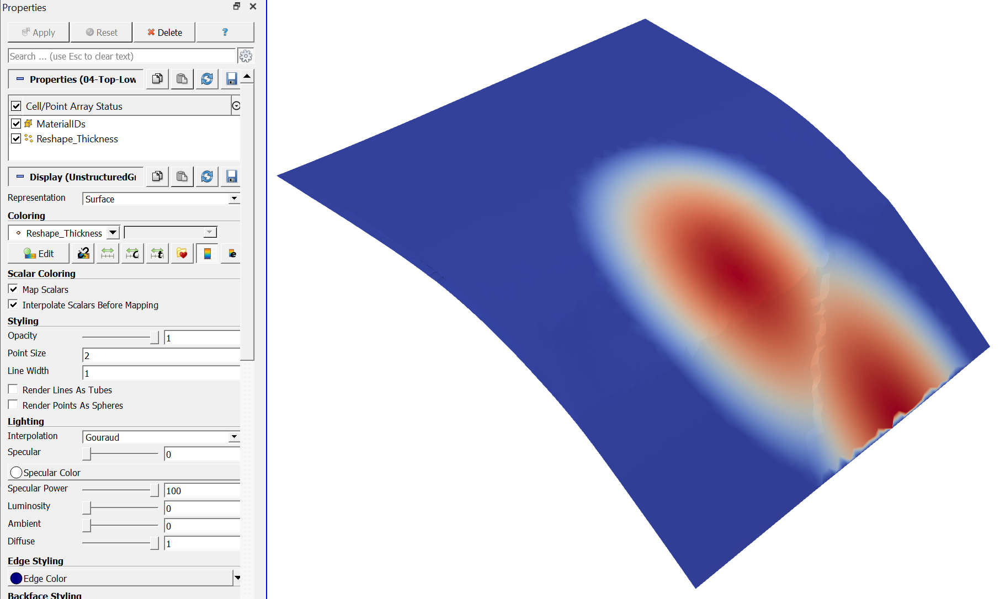

+++
date = "2019-12-03T00:00:00+01:00"
title = "GocadTSurfaceReader"
author = "Karsten Rink"

[menu]
  [menu.tools]
    parent = "Data Import/Export"
+++

## Introduction

This is a utility for handling GoCAD data. GoCAD has a number of possible file extensions and data types contained within those files. One file may contain multiple data sets. In addition, a file with a specific extension need not only contain data of the type that the extension suggests.

At the moment, this utility can read:

* VSET (Voxel Set)
* PLINE (Polyline)
* TSURF (Triangulated Surfaces)

Expected file extensions for these data types include *.vs,*.pl, *.ts, and*.mx (the last one for **m**i**x**ed data).

Another data type, SGRID (Structured Grid, usually saved to *.sg files) can be converted via the [GoCadSGridReader](../../meshing/gocadsgridreader).

Parsers for additional GoCAD-datasets may be added in the future.

## Usage

```bash
   GocadTSurfaceReader  -i <filename.ts> -o <output dir> [-l] [-s] [-b]
                        [--] [--version] [-h]


Where:

   -i <filename.ts>,  --input-file <filename.ts>
     (required)  Gocad triangular surfaces file (*.ts)

   -o <output dir>,  --output-dir <output dir>
     (required)  output directory

   -l,  --lines-only
     if set, only PLine datasets will be parsed from the input file

   -s,  --surfaces-only
     if set, only TSurf datasets will be parsed from the input file

   -b,  --write-binary
     if set, OGS-Meshes will be written in binary format
```

Unless specified otherwise, the utility will convert all datasets and write them to the specified output directory. Using the flags ```-l``` and ```-s```, conversion can be limited to lines or surfaces, respectively. Datasets will usually have a name specified. This name is used for the output file. If no name is given, the file name will be used instead. Should multiple datasets have the same name (which is possible in GoCAD), a mesh-ID will be added to the file name. This ID has no function except to allow the writing of multiple datasets with the same name into the same directory.

Datasets may have additional scalar data assigned to nodes. If so, this data is also added to the output data.

## Simple example

**Command:**

```bash
GocadTSurfaceReader -i d:\GoCAD_data\Top-Lower_Sandy.ts -o d:\GoCAD_data
```

**Input:**


**Output:**


