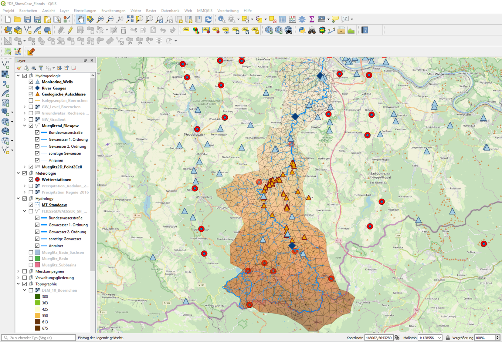

+++
date = "2019-12-03T00:00:00+01:00"
title = "Mesh2Shape"
author = "Karsten Rink"
+++

## Introduction

Converts a 2D surface mesh into a Shapefile such that each element is represented by a polygon. Cell attributes are transferred onto shape polygons while point attributes are ignored.

## Usage

```bash
   Mesh2Shape  -i <input_file.vtu> -o <output_file.shp>


Where:

   -i <input_file.vtu>,  --input-file <input_file.vtu>
     (required)  OGS mesh file (*.vtu, *.msh)

   -o <output_file.shp>,  --output-file <output_file.shp>
     (required)  Esri Shapefile (*.shp)
```

## Simple example

**Input data:**

 has been converted onto cells via VTK's PointToCell-Filter.")

**Command:**

```bash
Mesh2Shape -i Mueglitz2D_Point2Cell.vtu -o Mueglitz2D_Point2Cell.shp
```

.")



## Application

The utility allows to export meshes, and in particular simulation results, into existing GIS-projects and use the data as input for subsequent workflows.
