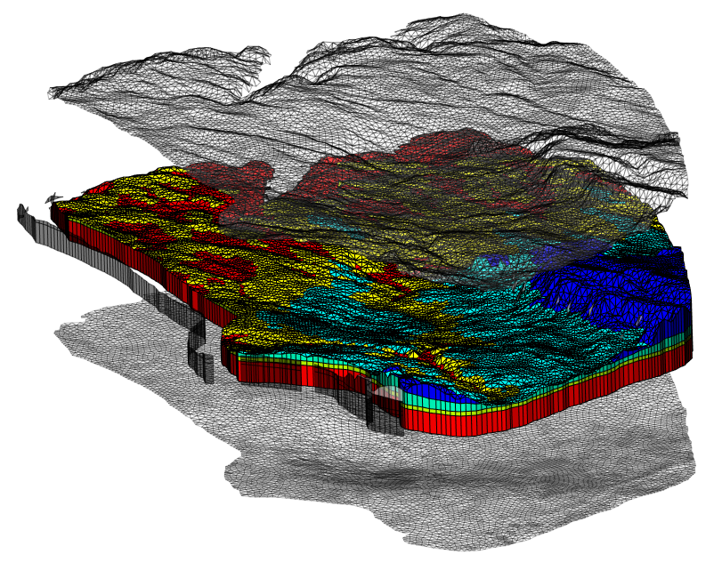

+++
date = "2018-03-07T15:56:57+01:00"
title = "Extract Surface"
author = "Thomas Fischer"

[menu]
  [menu.tools]
    parent = "meshing-submeshes"
+++

## General

The tool extracts 2d surface elements of a mesh given either in the vtu or msh format. Since the algorithm uses the element surface normals a correct node ordering of the element nodes is required. The user can specify the components of the normal the extracted surface should have.

## Usage

```bash
ExtractSurface -i [<file name of input mesh>] [-o <file name of output mesh>]
 [-x <floating point value>] [-y <floating point value>] [-z <floating point value>]
 [-a <floating point value>]
 [--ascii-output]
 [--face-property-name <string>]
 [--element-property-name <string>]
 [--node-property-name <string>]
```

- The normal of the surface that should be extracted is given by the arguments `-x`, `-y` and `-z`. The default normal is (0,0,-1).
- The command line option `-a` can be used to specify the allowed deviation of the normal of the surface element from the given normal.
- The data arrays added to the surface mesh by using the options `--face-property-name` (default value 'bulk_face_ids'), `--element-property-name` (default value 'bulk_element_ids'), and `--node-property-name` (default value 'bulk_node_ids') are used in other tools (for instance in [ComputeNodeAreasFromSurfaceMesh]()) and is required for flux calculations during a simulation run of OpenGeoSys.
- The switch 'ascii-output' produces vtu-files containing the data in human readable ASCII format instead of binary format.

## Example



Extracted top, bottom and side surfaces:

- top `ExtractSurface -i Input.vtu -o TopSurface.vtu`
- bottom `ExtractSurface -i Input.vtu -o BottomSurface.vtu -x 0 -y 0 -z 1`
- side `ExtractSurface -i Input.vtu -o SideSurface.vtu -x 1 -y 1 -z 0 -a 45`


