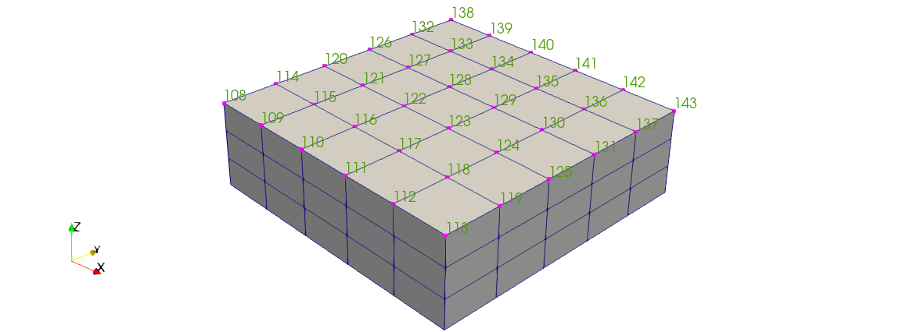
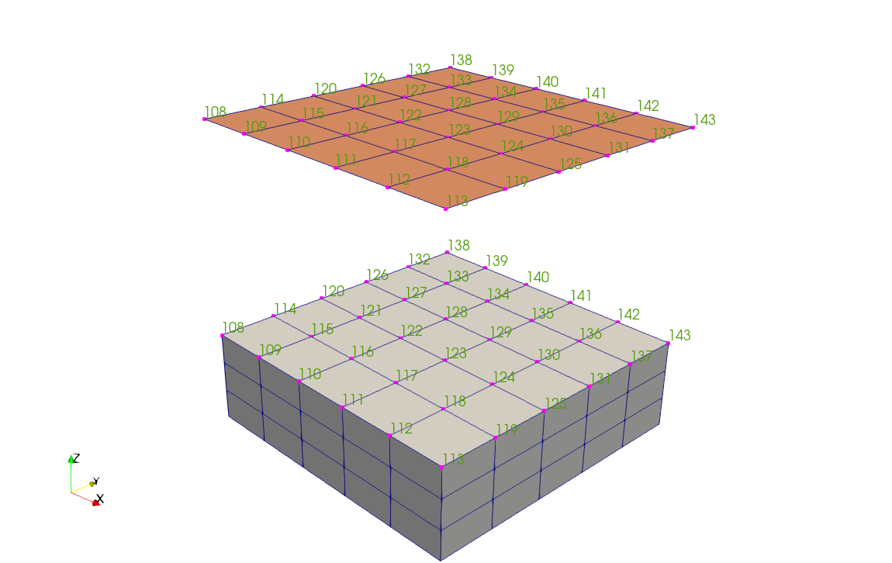

+++
date = "2019-03-19T09:56:57+01:00"
title = "Submeshes for Boundary Conditions, Source Terms, and Flux Calculations"
author = "Thomas Fischer"
weight = 1

[menu]
  [menu.tools]
    parent = "meshing-submeshes"
+++

## Motivation

Boundary conditions are defined on the boundary of a given domain. Source terms
may exist on subdomains of the domain. Sometimes the flux across a subdomain
is interesting for the modeller.

Consequently, we need a way to specify such subdomains for the Finite Element
simulation. There are several possibilities to define a subdomain. One
possibility is to use a geometry via a `.gli`- or `.gml`-file. Since the geometry
often doesn't match exactly on the domain mesh, one has to specify a search
radius to find nodes, elements, or faces in the neighborhood of the geometry.
It can be difficult to find an appropriate search radius for adaptive refined
domain meshes. Finally, with the geometry and a suitable search radius the
associated domain elements and domain nodes are searched for. Since this happens
during the simulation, this approach is not very robust.

Another possibility, avoiding the search during the simulation and thus more
robust, is to precompute the subdomains as meshes. These precomputed subdomains
are now passed to the OGS-6 simulator in the same format as the bulk mesh, the
VTU format. The subdomains additionally contain information to identify the
corresponding bulk mesh entities like nodes, elements and faces of elements.

### A simple example

In the next figures it is explained how a boundary condition can be set to the
top surface of a quad domain for a OGS-6 simulation. The first figure depicts
the bulk mesh and the id's of the nodes on the top.

The differently coloured top surface mesh can be obtained for instance by the
[ExtractSurface]() tool.

For visualisation purposes the top surface is translated upwards. The picture
shows the bulk mesh and the id's of the nodes on the top of it. Furthermore,
the translated top surface mesh with the corresponding bulk node id's are
represented.

