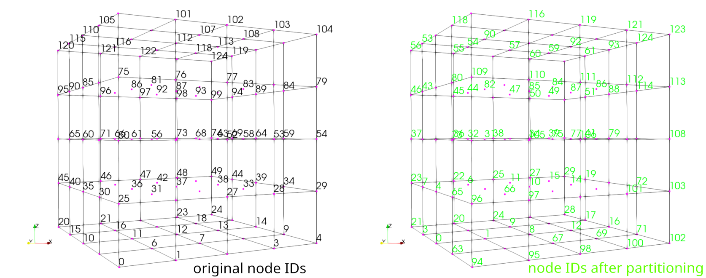
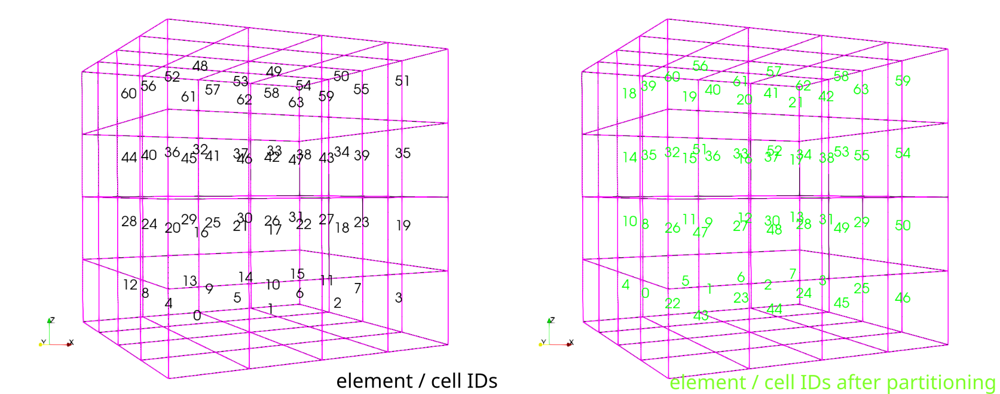

+++
title = "Reorder Mesh"
date = "2022-12-05T15:46:57+01:00"
author = "Thomas Fischer"
+++

## Building the Tool ReorderMesh

The tool is build when the `OGS_BUILD_UTILS` CMake switch is set `ON`. The build
executable `ReorderMesh` is placed in the `bin` directory. The tool is a command line tool.

Running `ReorderMesh` tool will print the required arguments and a short usage message; for detailed usage add the `--help` argument.

```bash
> ReorderMesh --help ⏎
```

To reorder a bulk mesh two arguments are required:

- file name for the input mesh including `bulk_node_ids` and `bulk_element_ids` information,
- file name for the reordered mesh.

## Why is the tool necessary?

In contrast to a serial simulation

```mermaid
graph LR
    OGS_PRJ[project file]:::InputStyle -->|xml format| OGS
    OGS_BULK[bulk mesh]:::InputStyle -->|vtu format| OGS
    OGS_BOUNDARY[boundary meshes]:::InputStyle -->|vtu format| OGS
    OGS_SOURCE[source term meshes]:::InputStyle -->|vtu format| OGS
    OGS(OpenGeoSys):::OGSStyle -->|vtu format| OGS_PRESSURE[simulation results]:::OGSOutputStyle

classDef InputStyle fill:#9090ff
classDef OGSStyle fill:#104eb2, color:#ffffff
classDef OGSOutputStyle fill:#a0a0f0
```

for a parallel simulation

```mermaid
graph LR
    OGS_PRJ[project file]:::InputStyle -->|xml format| OGS
    OGS_BULK[bulk mesh]:::InputStyle -->|vtu format| PARTMESH
    OGS_BOUNDARY[boundary meshes]:::InputStyle -->|vtu format| PARTMESH
    OGS_SOURCE[source term meshes]:::InputStyle -->|vtu format| PARTMESH
    PARTMESH[domain decomposition]:::DDCStyle -->|binary format| OGS
    OGS(parallel OpenGeoSys):::OGSStyle -->|pvtu format| OGS_PVTU[parallel simulation results]:::OGSOutputStyle
    OGS(parallel OpenGeoSys):::OGSStyle -->|HDF5 format| OGS_XDMFHDF5[parallel simulation results]:::OGSOutputStyle

classDef InputStyle fill:#9090ff
classDef OGSStyle fill:#104eb2, color:#ffffff
classDef DDCStyle fill:#f2a817
classDef OGSOutputStyle fill:#a0a0f0
```

a domain decomposition is required as a preprocessing step. As you can see in
the following pictures the domain decomposition (into 2 sub-domains) changes the
sequence of nodes and elements. On the left the initial node and element
orderings are depicted, on the right the ordering after partitioning is shown.





Simple element-wise or node-wise comparisons of simulation results are not
possible. The tool `ReorderMesh` can be applied to reorder the nodes and
elements to the initial ordering.

Typically, the workflow is as follows:

```mermaid
graph LR
    OGS_PARALLEL_SIMULATION_RESULTS(parallel simulation results):::InputStyle -->|pvtu| OGS_REMOVE_GHOST_DATA[pvtu2vtu]:::OGSStyle
    OGS_REMOVE_GHOST_DATA[pvtu2vtu]:::OGSStyle -->|vtu|OGS_IDENTIFY_SUBDOMAIN(identifySubdomains):::OGSStyle
    OGS_IDENTIFY_SUBDOMAIN:::OGSStyle -->|vtu with bulk ids|OGS_REORDER_MESH(ReorderMesh):::OGSStyle
    OGS_REORDER_MESH(ReorderMesh):::OGSStyle -->OGS_REORDERED_PARALLEL_SIMULATION_RESULTS(reordered simulation results):::OGSOutputStyle

classDef InputStyle fill:#9090ff
classDef OGSStyle fill:#104eb2, color:#ffffff
classDef DDCStyle fill:#f2a817
classDef OGSOutputStyle fill:#a0a0f0
```

A similar workflow is implemented using `snakemake` for testing the `ReorderMesh`
tool.
