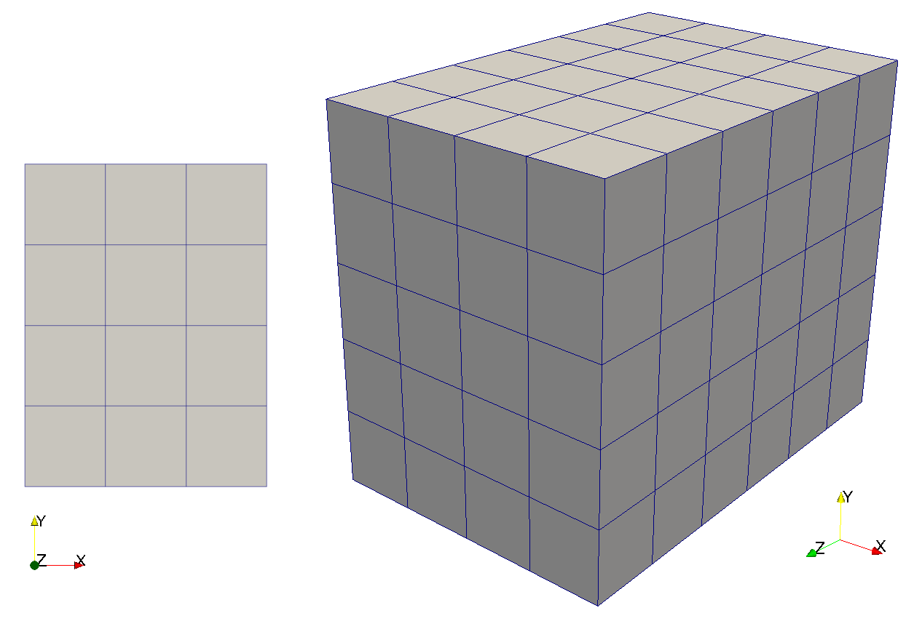
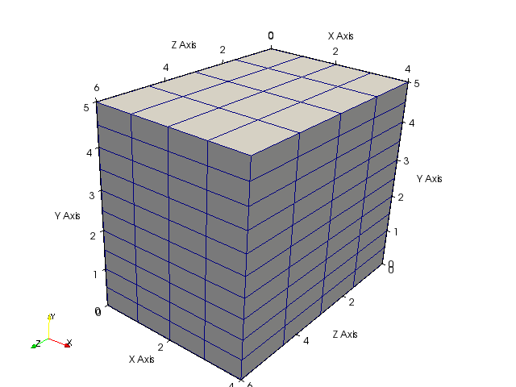
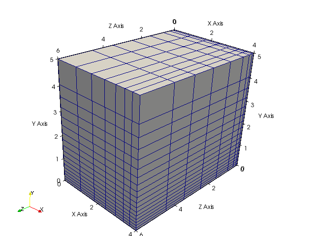

+++
title = "Structured Mesh Generation"
date = "2018-03-07T15:46:57+01:00"
author = "Thomas Fischer"
+++

## Building and using the tools

Generation of simple meshes in all dimensions can be accomplished with following command line tool.

The mesh generation tools are build when the `OGS_BUILD_UTILS` CMake switch is set `ON`. The build executable `generateStructuredMesh` is placed in the `bin` directory. The tool is a command line tool.

Running `generateStructuredMesh` tool will print the required arguments and a short usage message; for detailed usage add the `--help` argument.

```bash
> bin/generateStructuredMesh --help ⏎
```

To generate a mesh two arguments are required: file name for the resulting mesh, and the element type; depending on the element type chosen (a line, triangle, quad, tetrahedron, hexahedron, prism, or pyramid) length information for one, two, or three dimensions will be required.

## Examples

- To generate a simple 2-dimensional mesh measuring 3 by 4 length units call

```bash
> bin/generateStructuredMesh -o quad_3x4.vtu -e quad --lx 3 --ly 4 ⏎
info: Mesh created: 20 nodes, 12 elements
```

- To generate a simple 3-dimensional mesh measuring 4 by 5 by 6 length units call

```bash
> bin/generateStructuredMesh -o hex_4x5x6.vtu -e hex --lx 4 --ly 5 --lz 6 ⏎
info: Mesh created: 210 nodes, 120 elements.
```



## Basic options

### Output mesh format `-o filename.ext`

Depending on the file ending `.msh` or `.vtu` either a legacy OGS-5 mesh file or VTK unstructured grid file is generated. Unsupported file endings will result in an error.

### Mesh element type `-e <line|tri|quad|hex|tet>`

- Line elements are available for the 1-dimensional meshes.
- Quad (and triangle) elements are available for the 2-dimensional meshes. The triangle meshes will be constructed from the quad meshes by dividing each of the quad elements into two triangle elements.
- Hex and tetrahedron elements are available for the 3-dimensional meshes.

__Note:__ The generated FEM elements will be all of the first order corresponding to Line1, Tri3/Quad4, Hex8, Tet4, Prism6, and Pyramid5.

### Lengths `--lx`, `--ly`, `--lz`

The mesh lengths for each direction can be specified. If not given in `--dx*` arguments the default elements' lengths are 1. The last element in the corresponding direction can be of different size if the ratio of mesh's length in that direction to element's length in the same direction is not an integer.

The parameters must be positive real numbers.

## Uniform mesh refinement

### Number of subdivisions  `--nx`, `--ny`, `--nz`

One possibility to control the number of elements generated is to specify the number of subdivisions in any direction. The mesh along given coordinate will be equidistantly divided.

_Note:_ This parameter overrides any specifications given with `--dx*` arguments.

The parameters must be positive integers.

### Element length  `--dx0`, `--dy0`, `--dz0`

Another possibility to control the number of generated elements is to specify the elements' lengths in each direction. All of the elements will be of given size (if not overridden by `--n*` or `--m*` arguments) but the last (in each direction), which can be of different size to close the gap to the given mesh length, _i.e._ if for example the ratio `--lx` over `--dx0` is not an integer.

_Note:_ This parameter is overridden by the `--n*` parameters, or by `--d*-max` parameters if the given arguments are smaller than those of the `--d*0` parameters. Also specifying `--m*` parameters changes the element length.

The parameters must be positive real numbers

### Example

Hexahedral mesh as above but with 10 elements in y-direction and element length of 1.5 in z-direction:

```bash
> bin/generateStructuredMesh -o hex_4x5x6.vtu -e hex --lx 4 --ly 5 --lz 6 --ny 10 --dz0 1.5 ⏎
info: Mesh created: 275 nodes, 160 elements.
```



## Non-uniform mesh refinement

### Element length multiplier  `--mx`, `--my`, `--mz`

To generate non-uniformly refined meshes the element length multiplier (different than 1, which is its default value) is used. It describes relative element length growth in single direction.

By default the initial element length is 1 but can be specified using the `--d*0` arguments.
Consider initial element length (in x-direction for example) being $l_0 = 0.1$ and the corresponding element length multiplier to be equal $m=2$. Then the element lengths will be
$$
\eqalign
{
    l_{i + 1} &= l_i \cdot m \text
    {for $i=0,1,0, \ldots}\cr
l_{i+1} &= 0.1 \cdot 2^i = 0.2, 0.4, 0.8, \text{\ldots,}
}
$$

The parameters must be positive real numbers

### Maximum element length  `--dx-max`, `--dy-max`, `--dz-max`

To limit fast growing element lengths the maximum element length can be used. After the elements' length reached given maximum value the growth stops and the maximum value is used until the specified mesh length in that direction is reached.

The parameters must be positive real numbers

### Example

Hexahedral mesh as above but with three different non-uniform mesh refinements:

- x-direction: Element shrinking (growth factor < 1) starting with default element length 1.
- y-direction: Element growth (factor 1.1) starting with specified element length 0.1.
- z-direction: Fast element growth (factor 2) starting with specified element length 0.1 and limited by maximum length 1. (The last element is larger than maximum because of the gap to be filled for the given mesh length as described in uniform-mesh refinement section.)

```bash
bin/generateStructuredMesh -o hex_4x5x6.vtu -e hex --lx 4 --ly 5 --lz 6 --mx 0.8 --my 1.1 --dy0 0.1 --mz 2 --dz-max 1 --dz0 0.1 ⏎
info: Mesh created: 1368 nodes, 1008 elements.
```


