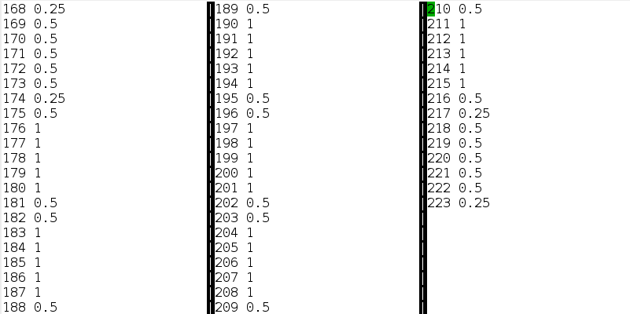

+++
date = "2018-03-07T15:56:57+01:00"
title = "Compute Node Areas From Surface Mesh"
author = "Thomas Fischer"

[menu]
  [menu.tools]
    parent = "model-preparation"
+++

## General

In the process of incorporating boundary conditions of second type (or Neumann boundary conditions) into the simulation model, the area associated to each surface node is needed for the local assembly. This tool reads a surface mesh (see also [ExtractSurface]()), computes the associated area for each node and writes the information as TXT and CSV data.

## Usage

```bash
ComputeNodeAreasFromSurfaceMesh -i <file name of input mesh>
    [-p <output path and base name as one string>]
    [--id-prop-name <property name>]
```

If the option `-p` is not given the output path is extracted from the input path. The default value for the `--id-prop-name` argument is "bulk_node_ids". This name is also used by [ExtractSurface]() for storing the subsurface node ids.

## Example


The following steps were performed to obtain the example data:

 1. The hexahedral example domain was created by [generateStructuredMesh]() `generateStructuredMesh -o hex_6x7x3.vtu -e hex --lx 6 --ly 7 --lz 3`.
 2. The tool [ExtractSurface]() was applied:
 `ExtractSurface -i hex_6x7x3.vtu -o hex_6x7x3_surface.vtu`
  The generated surface mesh contains a property "bulk_node_ids" assigned to the mesh nodes that contains the original subsurface mesh node ids.
 3. Finally `ComputeNodeAreasFromSurfaceMesh -i hex_6x7x3_surface.vtu` generates two text files (`hex_6x7x3_surface.txt` and `hex_6x7x3_surface.csv`). The TXT file is usable as boundary condition input file for OGS-5 simulation. The first column of the text file contains the original mesh node id (see image above), the second column the associated area. For example to the corner node 168 an area of 0.25 is associated. The edge node 169 has an area value of 0.5 and the interior node 176 has an area value of 1.


