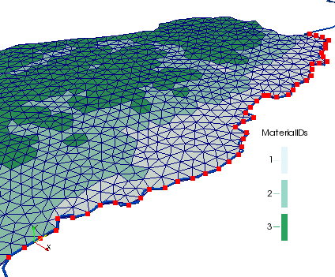

+++
date = "2018-03-07T15:56:57+01:00"
title = "Create boundary conditions along a polyline"
author = "Thomas Fischer"
+++

## General

The tool `CreateBoundaryConditionsAlongPolylines` searches for mesh nodes that are near to polylines and generates for each found node an OGS-5 boundary condition at a point.

The user has to provide the input mesh `mesh` and the geometry `geometry` that must contain at least one polyline. Possible input formats for the mesh are the legacy OGS-5 mesh format or the VTU format. The geometry can be provided in the legacy OGS-5 GLI format as well as in the gml format. The user can specify an environment via a search radius around the polyline. For all nodes within this environment boundary conditions are generated. Furthermore the type of the process the boundary condition is belonging to should be given. At the moment there are boundary condition output for LIQUID_FLOW (primary variable PRESSURE1) and STEADY_STATE_DIFFUSION (primary variable HEAD) process available.

The tool will output a OGS-5 boundary condition file (`.bc`) and a geometry file (`.gli`) containing the points the boundary conditions refer to. The original geometry will not be altered. Additional, it is possible to write the geometry in the gml format by setting the switch `gml` to 1.

The polylines should be in the vicinity of the mesh nodes, where the user wants to set the boundary conditions. The tool will generate boundary conditions at every node which lies within the search radius `search_radius`. Ideally, the geometry should be mapped as close as possible to the area the user wants to set boundary conditions (for this, also see tool [MapGeometryToSurface]()).

## Usage

```CreateBoundaryConditionsAlongPolylines -m [mesh] -i [input-geometry] -s [search_radius] -t [process type] -o [output-path] --gml 1```

## Example

. These data (mesh and geometric description of the river) is given to the tool.")



## Application

The tool was used for the setup of the hydro-geological model of the Unstrut catchment:


