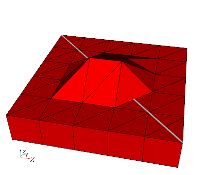
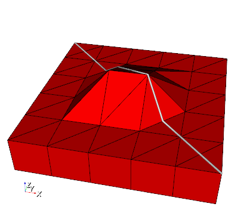

+++
date = "2018-03-07T15:56:57+01:00"
title = "Map geometric object to the surface of a mesh"
author = "Thomas Fischer"

[menu.tools]
parent = "model-preparation"
+++

## General

The tool ```MapGeometryToMeshSurface``` adjusts the z-coordinates of geometric points from a given geometry file ```my_geometry.gml``` such that they are located on the surface of a given mesh ```my_mesh.vtu``` and returns an updated geometry file ```my_mapped_geometry.gml```.

## Usage

```bash
MapGeometryToMeshSurface -m [my_mesh.vtu] -i [my_geometry.gml] -o [my_mapped_geometry.gml]
```

## Simple application example





Usage for the example:

```bash
MapGeometryToMeshSurface -m SubsurfaceMesh.vtu -i TestPolyline.gml -o TestMappedPolyline.gml
```

## References

<!-- vale off -->

Karsten Rink, Lars Bilke, Olaf Kolditz: Visualisation Strategies for Environmental Modelling Data. Environmental Earth Sciences, 2014.
DOI:10.1007/s12665-013-2970-2 [download](http://link.springer.com/article/10.1007%2Fs12665-013-2970-2)

<div class='note'>

### Example Files

- [SubsurfaceMesh.vtu](SubsurfaceMesh.vtu)  
- [TestPolyline.gml](TestPolyline.gml)  

</div>
