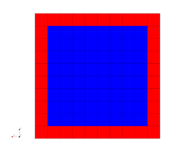

+++
date = "2018-03-07T15:56:57+01:00"
title = "Set Properties in Polygonal Region"
author = "Thomas Fischer"

[menu]
  [menu.tools]
    parent = "model-preparation"
+++

## General

The tool `ResetPropertiesInPolygonalRegion` changes the property values of all elements of a mesh `mesh` in which at least one node of the element lies within the cylindrical volume defined through a given polygon `polygon_name` within the geometry `geometry` to a new value.

The new value must be of one of the data types, either [integer](https://en.wikipedia.org/wiki/Integer_(computer_science)) {1, 2, 3, ...} (`new_int_value`), character {'a', 'b', 'c', ...} (`new_character_value`), or [boolean](https://en.wikipedia.org/wiki/Boolean_data_type) {true,false} (`new_boolean_value`). The new value must fit the the chosen property type of `name_of_property`.

The polygon must be located within a plane. A node is located in the cylindrical volume iff (ie. if and only if) the node's orthogonal projection to the plane of the polygon lies in the polygon, ie. the plane can be defined in any arbitrary direction in 3d space.

In combination with a threshold filter the tool can also be used to cut out some region of the mesh. The tool can be also used in combination with the tool [removeMeshElements]().

The tool writes a new mesh `modified_mesh`.

## Usage

```bash
ResetPropertiesInPolygonalRegion
    -m [mesh]
    -r [MaterialID]
    -n [name_of_property, default MaterialIDs]
    -i [new_int_value, optional]
    -c [new_character_value, optional]
    -b [new_boolean_value, optional]
    -g [geometry]
    -p [polygon_name]
    --any_of
    -o [modified_mesh.vtu]
```
By default all nodes of an element have to be inside the polygon to set the
property on the element. By specifying the boolean switch `any_of` at the
command line the criterion for element selection changes to 'at least one
node has to be inside the polygon'.

## Examples

### First Example

. Furthermore, the input polygon is sketched.")



Example usage:

```bash
ResetPropertiesInPolygonalRegion
    -m TestCube.vtu
    -n ValidCells
    -c B
    -g TestPolylines.gml
    -p Back
    -o TestCube-BackPolylinePropertyChange.vtu
```

Creates a new property "ValidCells" and sets the value for the property of elements in the polygonal region "Back" to "B".

### Second Example

 with the original 10 layers
symbolized by the different colours. At the bottom of the cube two regions are
depicted by their bounding polygons. The intermediated mesh in the middle figure
was generated by the following command:")

```bash
ResetPropertiesInPolygonalRegion
    -m hex_5x5x5.vtu
    -g Regions.gml
    -p Region1
    -n MaterialIDs
    -i 11
    -r 2
    -o hex_5x5x5_Region1-Layer1.vtu
```

Here the elements with material ids 11 are displayed non-transparent.

The final mesh containing 12 material groups is represented in the right figure
and was created by the command

```bash
ResetPropertiesInPolygonalRegion
    -m hex_5x5x5_Region1-Layer2.vtu
    -g Regions.gml
    -p Region2
    -n MaterialIDs
    -i 12
    -r 5
    -o hex_5x5x5_Region1-Layer2_Region2-Layer5.vtu
```

Again, the elements that are assigned to the new material group 12 are displayed
non-transparent.

Download links for the files necessary to reproduce this example are at the end
of this site.

## Application

This workflow was successful used in the INFLUINS project cutting out the Unstrut catchment from a 3d geological structure model:



<div class='note'>

### Example Files

- [TestCube.vtu](TestCube.vtu)
- [TestPolylines.gml](TestPolylines.gml)
- [hex_5x5x5.vtu](hex_5x5x5.vtu)
- [Regions.gml](Regions.gml)
</div>
