+++
date = "2019-03-21T16:56:27+01:00"
title = "Example of a DGM-to-model-workflow"
author = "Marc Walther"

[menu]
  [menu.tools]
    parent = "workflows"
+++

<!-- vale off -->

## Workflow description

This documentation describes an exemplified workflow to create a groundwater flow model based on available data of a digital elevation model (here [SRTM data](https://earthexplorer.usgs.gov/)) and bathymetry data (here [GPDN](https://www.gpdn.de/?pgId=219)). As tools, it uses a GIS (here [QGIS](https://www.qgis.org)), the OGS DataExplorer and several [OGS tools](https://www.opengeosys.org/docs/tools/), as well as the meshing tool [Gmsh](http://gmsh.info) and visualization tool [ParaView](http://www.paraview.org). The first part of this documentation deals with the GIS work, the second with the OGS model setup.

## GIS data preparation and extraction

This part will prepare the DGM and bathymetry data as input for the model setup. For all the QGIS editing steps, you may additionally define an output file (but this is no requirement); if this is not defined, QGIS will load the results into the active project.

### Prepare elevation data

* It is likely that you will need to download more than one remote sensing image when the study area is large or overlapping the borders of one section. Download the required DGM data (here `.tif` files) of the study area and load them into QGIS.
 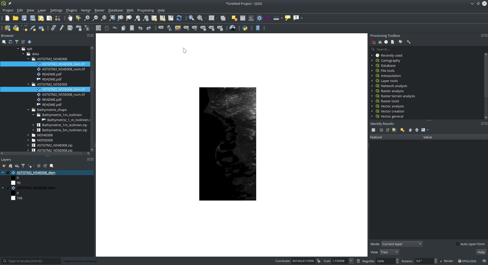
* Merge the images with `Raster` -> `Miscellaneous` -> `Merge...`; select the `Input Layer`s.
 
* Extract a subregion of the (merged) DGMs and define the study area through a shape file. One may also use a predefined shape file and continue with step 5. Choose `New Shapefile Layer...` from the toolbar and enter a `File name` and a projection.
 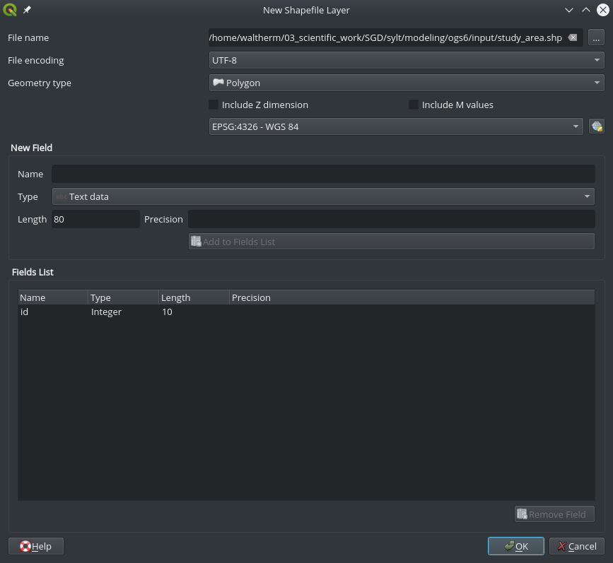
* Edit the shape (`Toggle Editing` in toolbar), add points, and save the layer edits.
 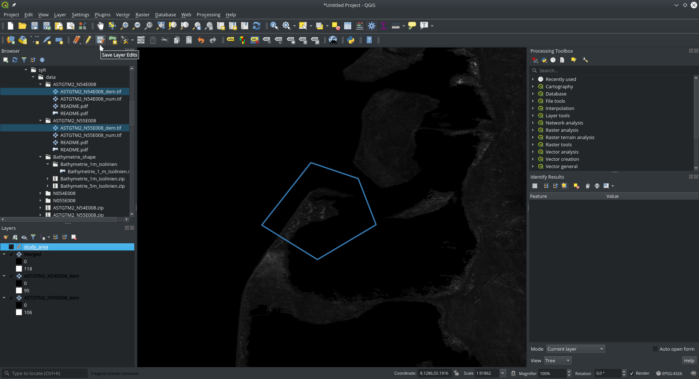
* Clip the DGM with the shape file with `Raster` -> `Extraction` -> `Clip Raster by Mask Layer...`; define `Input Layer` and `Mask layer`, and assign the `Nodata value`.
 
* If the raster does not have the correct projection, you will have to reproject it with the appropriate target system with `Raster` -> `Projections` -> `Warp (Reproject)`; select the `Input Layer` and the `Target CRS`.
 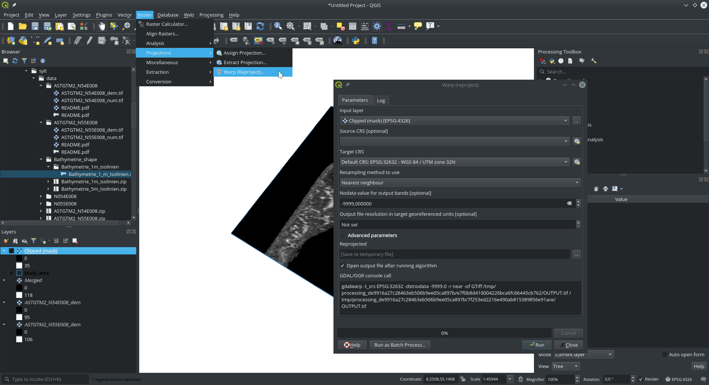
* This example also includes bathymetry data, which was available as vector data (isoline in a shape file). This file must be reprojected to the same coordinate system as the raster before with `Vector` -> `Data Management Tools` -> `Reproject Layer`; select `Input Layer` and the `Target CRS`.
 
* Before merging DGM and bathymetry, the shape data needs to be converted to raster data with `Raster` -> `Conversion` -> `Rasterize (Vector to Raster)`; define `Input Layer`, the z-value (`burn-in value`), the resolutions, and the `nodata value`.
 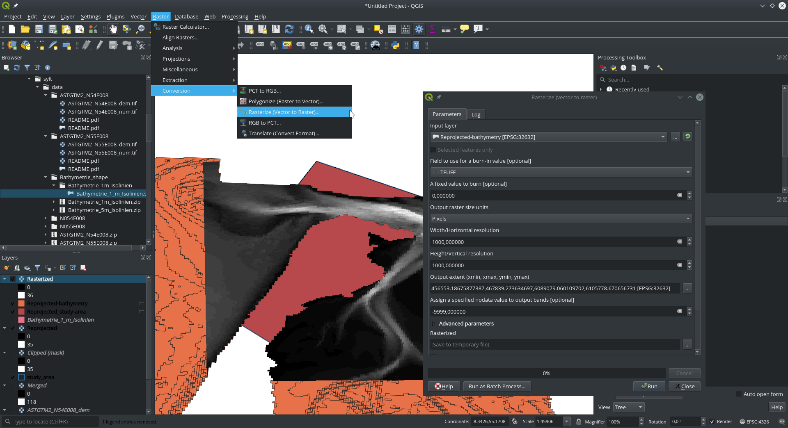
* As bathymetry was given as "depth", this parameter needs to be converted to an "elevation"; use `Raster` -> `Raster Calculator` and define the `Output layer`, the `Output format` and the `Raster Calculator Expression` (shown formula only inverts the sign).
 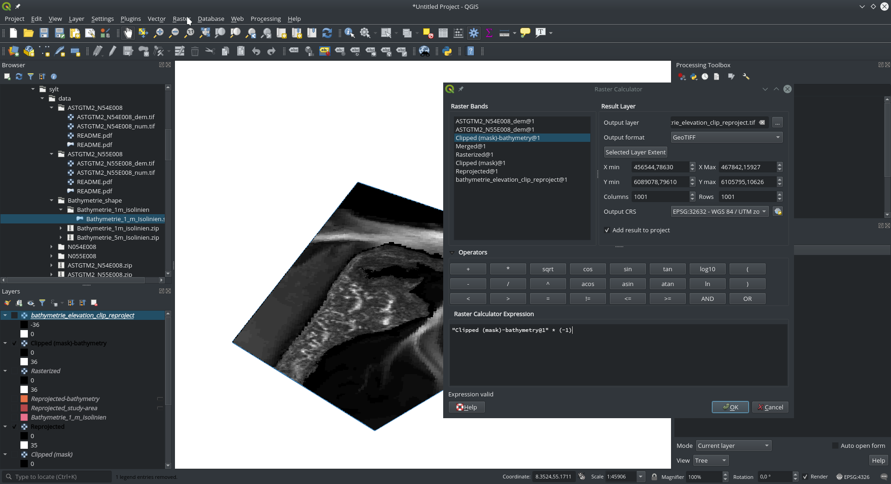
* Merge the DGM and bathymetry rasters (as done in step 2), and save the merged file as a `.asc` file with `Raster` -> `Conversion` -> `Translate (Convert Format)`; define the `Input Layer` and the `Converted` output file.
 

### Prepare study area features

* To make the coastline part of the mesh, the merged DGM-bathymetry will be used to create a contour isoline at an elevation of `0.01 m` with `Extraction` -> `Contour...`; select the `Input Layer`, set the `Interval between contour lines` to a high value and set the `Offset from zero`.
 
* If more than the `0.01 m` contour is present in the new shape file, remove the not required contours by right-clicking the new shape file and `Open Attribute Table`; click `Select features using an expression` and define the contours based on your liking that you want to exclude (here, anything with an elevation larger than 1 is removed).
 
* Finish the selection (close attribute table) and remove the selected features by editing the shape (`Toggle Editing`) and clicking `Delete Selected`; save the changes.
 
* The remaining features may have a high resolution (see red line in below figure); choose `Vector` -> `Geometry Tools` -> `Simplify...`, and select an `Input Layer` as well as the `Simplification method` with an appropriate `Tolerance`.
 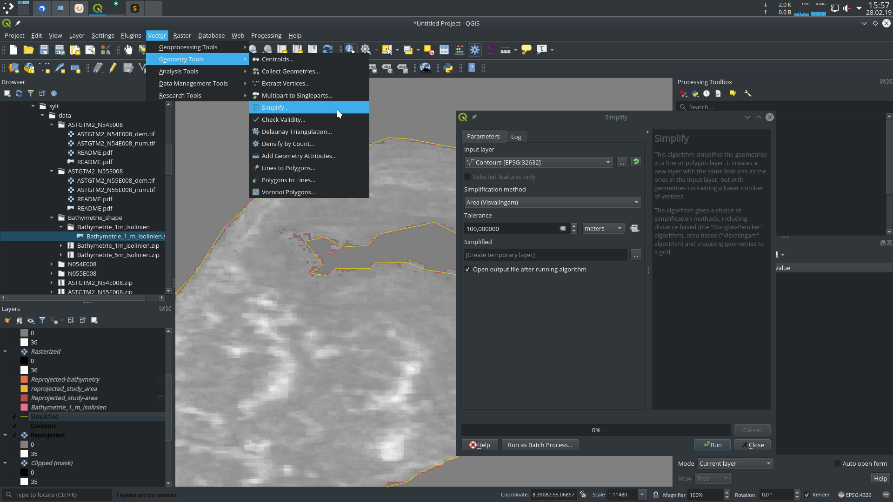
* Further, it might be useful to manually remove even more vertices from the polygon; `Toggle Editing` of the simplified shape and select and remove vertices.
  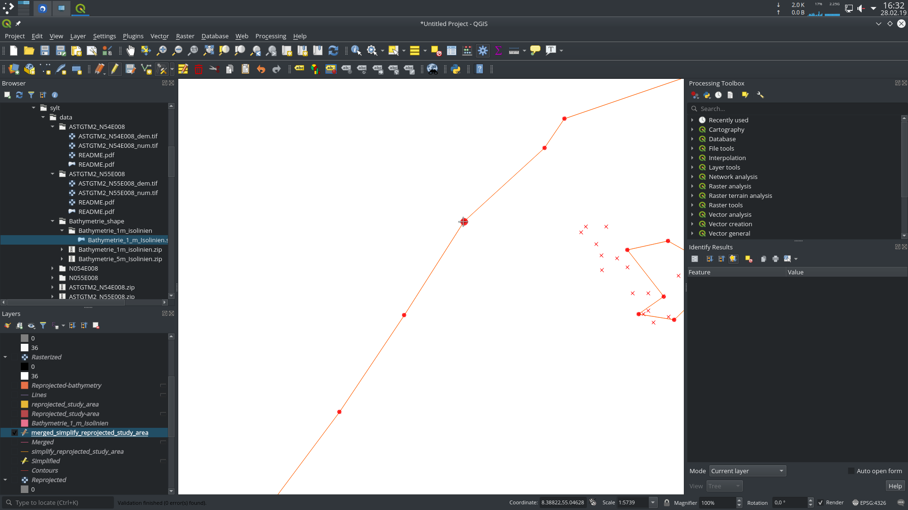
* The shape file used to clip the study area in step 5 will be used as the boundary of the model setup and be combined with the coastline. Firstly, convert the polygon of the study area to a polyline with `Vector` -> `Geometry Tools` -> `Polygons to Lines`; select the `Input Layer`.
 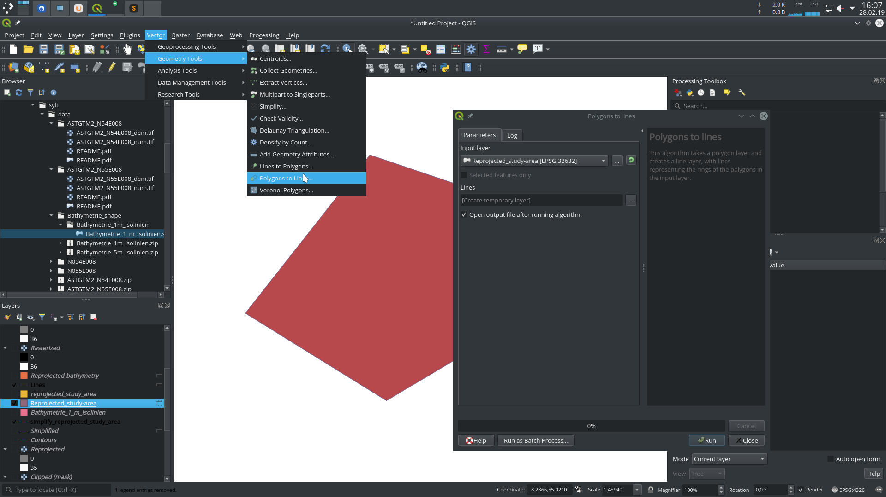
* Before merging the boundary and the coastline shapes, remove all fields from the boundary polyline through the `Attribute Table`; select everything and click `Delete field`.
 
* Merge the boundary polyline and the coastline with `Vector` -> `Data Management Tools` -> `Merge Vector Layers`; select `Input Layers`.
 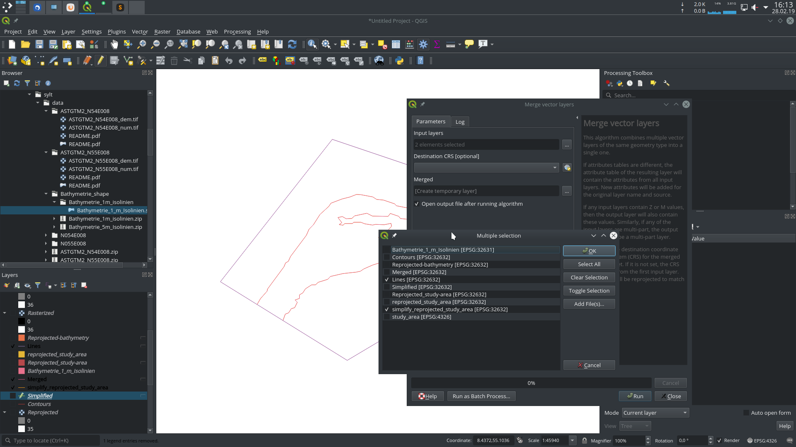

## OGS model setup

The next steps will use the OGS DataExplorer, GMSH, and ParaView to prepare the model input files. A 2D mesh will be generated from the merged shape file containing the study area boundary and the coastline; the elevation data will be used to define the surface of the model and subsurface layer information will be used to define the aquifer structure.

### 3D Mesh creation

* Load the merged boundary-coastline shape into the DataExplorer (`File` -> `Import` -> `Shape Files`). Creation of the 2D mesh can be done in two ways:
    a) Either use GMSH: Save the geometry as a `.geo` file for usage in GMSH by choosing the tab `Geometry` and clicking the save icon. Afterwards, use GMSH to generate a 2D mesh to your liking and import it with `File` -> `Import Files` -> `GMSH files...`.
     
    b) Or use the DataExplorer interface for GMSH: Use `Tools` -> `Create Mesh From Input Data...`.
     
    From the dialogue, select the geometry which should be used and let it show up on the right side (`Employed information`).
     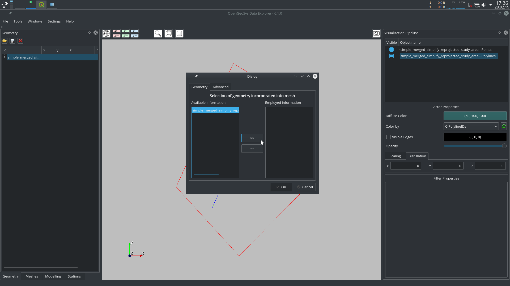
    Select the `Advanced` tab, choose `Adaptive meshing`, and remove the tick at `Delete GMSH geo-file after generating mesh` (in case you still want to manipulate the `.geo` file); click `OK`.
     
* To create a 3D mesh, the previously defined elevation data and subsurface layer data will be used to define multiple layers of the model. In the left-side tab `Meshes`, right-click the newly created (or imported) mesh, and choose `Edit mesh...`
 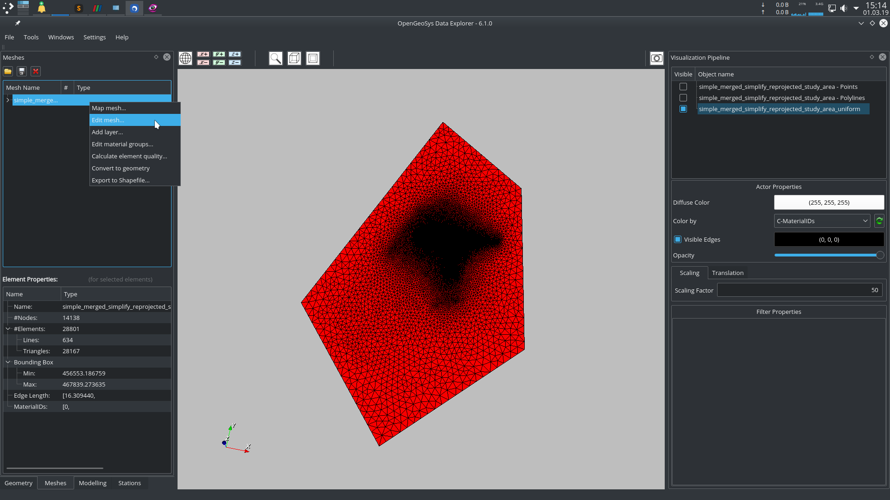
* In the new dialogue, `Specify the number of layers to add` (here 10), click `Add layers based on raster files`, and load all `.asc` files that define the different layers into the interface. Also, define a `Minimum thickness of layers` (here 5 height units).
 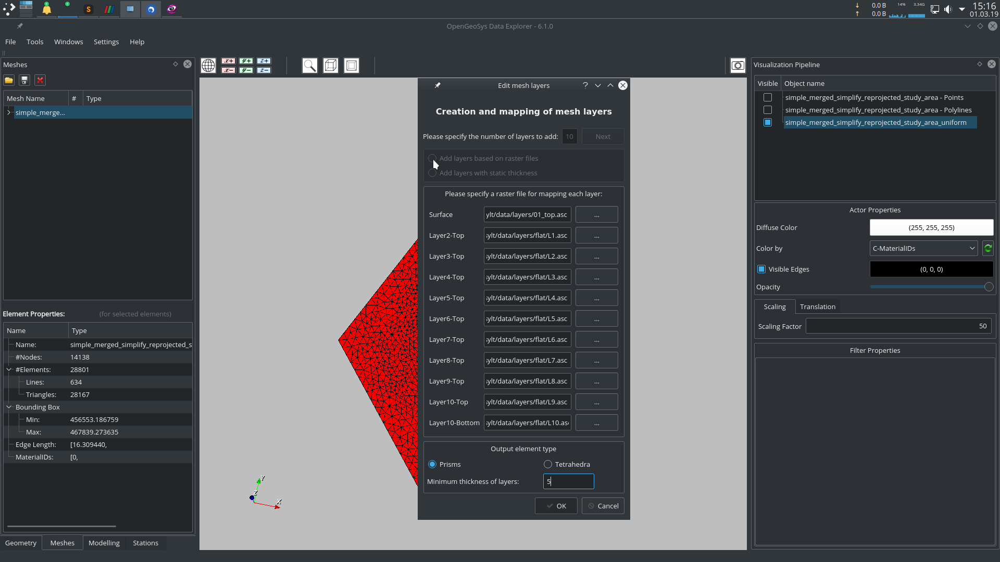

### Boundary condition definition

For the creation of the boundary conditions, use the following workflow.

* Save the created 3D mesh as a `.vtu` file by selecting the 3D mesh in the `Meshes` tab and clicking the save icon. In the new dialogue, choose a output directory, filename, and the `Data mode`.
 
* To define water level and groundwater recharge, the top surface of the mesh will be used. Extract the surface with the tool [`ExtractSurface`](). The following command is an example:
  `ExtractSurface -i SubsurfaceMesh.vtu -o exSurf.vtu -x 0 -y 0 -z -1 -a 30`
* ParaView will be used to define boundary and initial condition values.
For boundary conditions, a separation of the water level (Dirichlet) and recharge (Neumann) boundary condition is required. Load the extracted top surface into ParaView and apply the following filter pipeline:
    a) Apply a `Calculator` with the operation `coordsZ` to get a new parameter field with elevation data.
    b) Apply a `Threshold` and define the value range from the lowest to the water level (here -35 to 0.01 height units); this will be the input file for the Dirichlet boundary condition.
    c) Apply a `Calculator` with the operation `-9810*coordsZ` (i.e. fluid density multiplied by gravity by elevation) to get a pressure gradient.
    d) repeat b) and c) on the `Calculator` from a) but with the value range water level to highest value (in the `Threshold`), and define the recharge value for the land area (in the `Calculator`).
    e) Save the "land" and "water" meshes as `.vtu` files.
    
* Define the `.prj` file of your setup, including the 3D mesh and boundary condition meshes and run the simulation.
 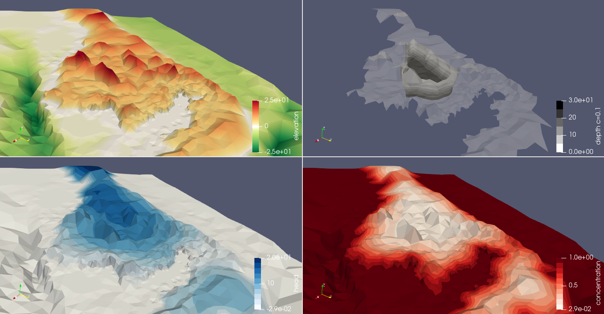
