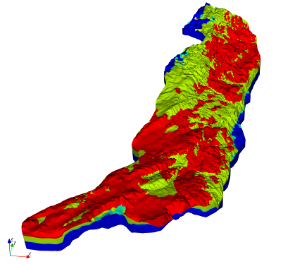
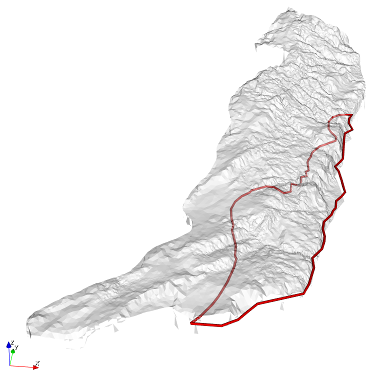
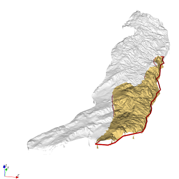
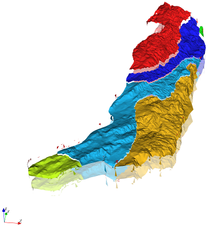

+++
date = "2018-03-07T15:56:57+01:00"
title = "Create Boundary Condition in Polygonal Region"
author = "Thomas Fischer"

[menu]
  [menu.tools]
    parent = "workflows"
+++

## General

In order to create boundary conditions in a polygonal region the following workflow can be used:

1. Extract surface using [ExtractSurface]() (a: Original subsurface mesh; b: Extracted surface)

    

    

2. Mark the mesh elements within the polygonal region deploying the tool [ResetPropertiesInPolygonalRegions]()

    

    

    

3. Remove marked/unmarked mesh elements deploying tool [removeMeshElements]()

    

4. Compute the associated area for the nodes of the surface mesh deploying tool [ComputeNodeAreasFromSurfaceMesh]()

The surface mesh patches (created until step 3) can be used as input for OGS-6 simulations. For OGS-5 simulations only the additional step 4 has to be performed.
